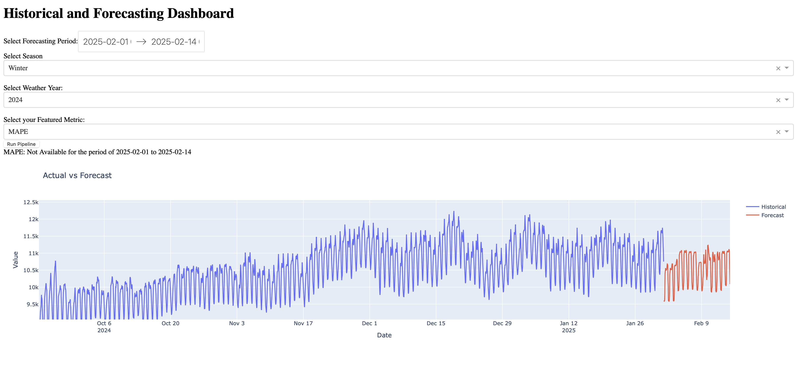

## Load Forecasting
This project performs energy consumption forecasting with only give feature as temprature. this project is designed to give user the range of inputs to select their desired forecasting period, their important feature and also the season in which they want to run this model on. 
it has the capability to have the options extended to the models of their choosing for training, their desired training period, their desired features and etc. but for the purpose of simpilicity we have kept these at minimum. 

## Pipeline Overview


### Data Preprocessing: 
This module, will load the give csv file (with the capability of adding selecting the loading range). and will also give the user their desired season values on each year. in this process we have added some extented features of DATETIME and temprature to capture the trends of the day and weather better. 

### Models:

In this module we have displayed a few models from ensembles and regression to train them on our data and predict future values

### DiagnoseForecast:

The core of this pipeline happens here. first we prepare test and train values, given the 14days evaluation, we always exclude them from training to check the models performance on the most recent dates. 
then we have a diagnose module which will accept a training period, a season, and a list of models. it will train all the models on the given period of time and save their performance metrices on a dcitionary. 
Then the forecasting function will take in a featured metric, a weather year, and a forecasting period and will choose the best trained model on diagnose based on the featured metric and will forecast on that period with the features extracted from the chosen weather year on that very same period based on historical values. 

## Note:
Ensure you have the necessary libraries and dependencies installed as per the script's requirements.

## Author: 
Sara Naseri Golestani


## Installation

In the terminal of the project root directory run:


1. Run `conda env create -f environment.yml` to create the environment
2. `conda activate enmax`

## Dashboard

on `dashboard.py` set the desired training period for diagnose and then run the following command on your conda environment

```
python dashboard.py
```
this will run a local dashboard on default ports: `127.0.01:8050`
the dashboard will accept inouts for your desired forecast and after you pres on run forecast, you would be able to see the forecasted values. 

### Example



---